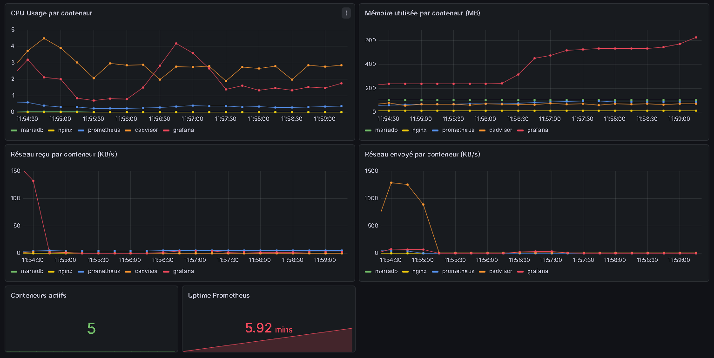

# Stack de Monitoring — Niveau 1 : Novice

Stack complète de monitoring avec Docker Compose comprenant Nginx, MariaDB, Prometheus, cAdvisor et Grafana.

## Services

| Service | Rôle | Port exposé |
|---|---|---|
| **Nginx** | Serveur web — sert les pages statiques et expose `/stub_status` pour les métriques | `80` |
| **MariaDB** | Base de données relationnelle — stocke les données applicatives | interne |
| **cAdvisor** | Collecte les métriques système de chaque conteneur Docker (CPU, RAM, réseau, disque) | `8080` |
| **Prometheus** | Scrape et stocke les métriques exposées par cAdvisor (et lui-même) toutes les 15 s | `9090` |
| **Grafana** | Visualise les métriques Prometheus sur un dashboard interactif | `3000` |

## Schéma global des services

```
┌──────────────────────────────────────────────────────────┐
│                     Docker Network                       │
│                                                          │
│  ┌─────────┐    ┌──────────┐    ┌────────────────────┐  │
│  │  Nginx  │    │ MariaDB  │    │      cAdvisor       │  │
│  │  :80    │    │ (interne)│    │  :8080 /metrics     │  │
│  └─────────┘    └──────────┘    └────────┬───────────┘  │
│       │                                  │ scrape        │
│  sert HTML                               ▼               │
│       │                         ┌────────────────────┐  │
│  (navigateur)                   │     Prometheus      │  │
│                                 │  :9090              │  │
│                                 └────────┬───────────┘  │
│                                          │ datasource    │
│                                          ▼               │
│                                 ┌────────────────────┐  │
│                                 │      Grafana        │  │
│                                 │  :3000   dashboard  │  │
│                                 └────────────────────┘  │
└──────────────────────────────────────────────────────────┘
```

## Lancement

```bash
docker compose up -d
```

### Accès aux interfaces

- **Nginx** → http://localhost:80
- **Prometheus** → http://localhost:9090
- **cAdvisor** → http://localhost:8080
- **Grafana** → http://localhost:3000 (admin / admin)

## Dashboard Grafana

Le dashboard **"Monitoring Stack"** est provisionné automatiquement au démarrage. Il affiche :

- CPU usage par conteneur
- Mémoire utilisée par conteneur (MB)
- Trafic réseau reçu/envoyé par conteneur (KB/s)
- Nombre de conteneurs actifs
- Uptime Prometheus



## Arrêt

```bash
docker compose down
```

Pour supprimer aussi les volumes (données) :

```bash
docker compose down -v
```
